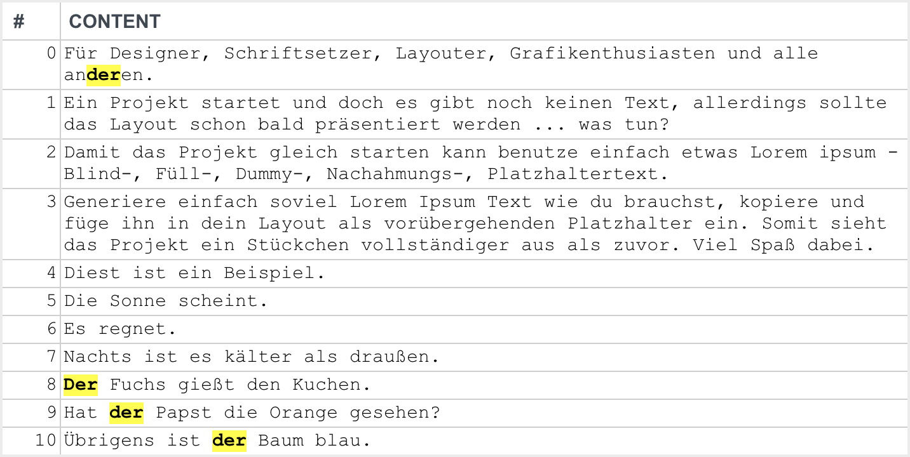

# LiveSearchPlugin

Plugin for [ExtJS 6][extjs] to add live search functionality to a grid.

While the SDK already includes a similar [Ext.ux.LiveSearchGridPanel][demo] component, there are some notable advantages/differences:

- Compatible with __locked__, __buffered__ and __reconfigurable__ grids

- Compatible with __sorted__ and __filtered__  stores

- Support for __data binding__

- __No__ widgets or toolbars will be added

- __Exclude__ columns from search



An example can be found [here][iss-web].

## Installation

Copy the content of this repo into `packages/local/ux-livesearch`:

    $ git submodule add https://github.com/katzer/Ext.ux.grid.plugin.LiveSearch.git packages/local/ux-livesearch

Add the plugin to list of required packages in your `app.json`:

   ```json
   "requires": ["ux-livesearch"]
   ```

Build your app

    $ sencha app build

## Contributing

Bug reports and pull requests are welcome on GitHub at https://github.com/katzer/Ext.ux.grid.plugin.LiveSearch.

1. Fork it
2. Create your feature branch (`git checkout -b my-new-feature`)
3. Commit your changes (`git commit -am 'Add some feature'`)
4. Push to the branch (`git push origin my-new-feature`)
5. Create new Pull Request

## License

The code is available as open source under the terms of the [MIT License][license].

[extjs]: https://www.sencha.com/products/extjs/
[demo]: https://examples.sencha.com/extjs/7.0.0/examples/classic/grid/live-search-grid.html
[iss-web]: https://github.com/appPlant/iss-web
[license]: http://opensource.org/licenses/MIT
